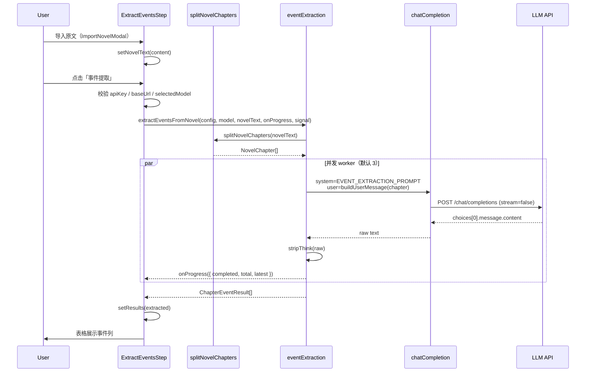

# 事件提取（Extract Events）技术文档

> 本文档描述 Isshin AI TextFlow 中「提取事件」工作流步骤的实现逻辑，及其与参考项目 Toonflow-app 的对应关系。

---

## 1. 功能概述

「事件提取」是项目创作流程六步中的第一步（`extractEvents`）。用户导入小说原文后，系统按章节调用大语言模型（LLM），将每章正文压缩为**一行结构化事件摘要**，并在 UI 下方表格中展示。

核心公式：

```
原文 → 章节切分 → (Skill Prompt + 章节元数据 + 章节正文) → LLM → 后处理 → 表格展示
```

与 Toonflow 的「事件分析」一致：**每章一次 LLM 调用**，输出为 pipe 分隔的单行文本，而非自由格式散文。

---

## 2. 与 Toonflow 的对应关系

| 维度 | Toonflow-app | Isshin AI TextFlow |
|------|--------------|-------------------|
| 核心类/模块 | `src/utils/cleanNovel.ts` → `CleanNovel` | `src/services/eventExtraction.ts` |
| System Prompt | DB `o_prompt.type = eventExtraction`，fallback `getPrompts("event")` | 常量 `EVENT_EXTRACTION_PROMPT`（`src/prompts/eventExtraction.ts`） |
| User Message 模板 | `请根据以下小说章节数：{index}小说章节券：{reel}...` | 同上，「券」修正为「卷」 |
| LLM 调用 | `u.Ai.Text("universalAi").invoke`，非流式 | `chatCompletion()`，OpenAI 兼容 `/chat/completions` |
| 响应后处理 | `stripThink(resData.text)` | `stripThink(raw)` |
| 并发 | 默认 5，`CleanNovel.start()` worker 池 | 默认 3，`extractEventsFromNovel()` worker 池 |
| 章节数据来源 | 导入时已写入 SQLite `o_novel` 表 | 前端内存 state，导入时用正则即时切分 |
| 结果持久化 | 写回 `o_novel.event` 字段 | **暂未持久化**，仅 React state |
| 触发方式 | 后端 API `POST /novel/event/generateEvents` + 轮询 | 前端按钮「事件提取」直接调用 |

---

## 3. 系统架构

### 3.1 模块分层

```
┌─────────────────────────────────────────────────────────────┐
│  UI 层                                                       │
│  ExtractEventsStep.tsx  ← ImportNovelModal.tsx              │
│  ProjectDetailView.tsx  ← CreationView.tsx  ← App.tsx       │
└────────────────────────────┬────────────────────────────────┘
                             │ props: config, selectedModel
                             ▼
┌─────────────────────────────────────────────────────────────┐
│  业务层                                                      │
│  eventExtraction.ts  — 编排切分、并发、进度回调              │
│  splitNovelChapters.ts — 章节切分                            │
│  eventExtraction.ts (prompt) — Skill / System Prompt        │
│  stripThink.ts — 模型输出清洗                                │
└────────────────────────────┬────────────────────────────────┘
                             │
                             ▼
┌─────────────────────────────────────────────────────────────┐
│  基础设施层                                                  │
│  chat.ts → chatCompletion()                                 │
│  api.ts → resolveApiUrl()                                   │
│  @tauri-apps/plugin-http → fetch                            │
│  config.ts → localStorage `textflow-config`                 │
└────────────────────────────┬────────────────────────────────┘
                             │
                             ▼
                    OpenAI 兼容 LLM API
                    POST {baseUrl}/chat/completions
```

### 3.2 配置与模型来源

事件提取与「对话」页共用同一套模型配置，由 `useAppState` 统一管理：

| 配置项 | 存储位置 | 说明 |
|--------|----------|------|
| `baseUrl` | localStorage `textflow-config` | API 基础路径 |
| `apiKey` | 同上 | Bearer Token |
| `models` | 同上 | 可用模型列表 |
| `selectedModel` | React state | 当前选中模型 |

Props 传递链：

```
App.tsx
  └─ CreationView { config, selectedModel, onConfigError }
       └─ ProjectDetailView { config, selectedModel, onConfigError }
            └─ ExtractEventsStep { config, selectedModel, onConfigError }
```

配置校验失败时，`App.tsx` 会同时 `setConfigError(message)` 并 `setSettingsOpen(true)`，引导用户打开设置面板。

---

## 4. 端到端数据流

### 4.1 时序图



### 4.2 状态机（ExtractEventsStep）

| 状态 | 条件 | UI 表现 |
|------|------|---------|
| 空态 | `novelText` 为空 | 虚线框 + 「请先导入小说原文…」 |
| 已导入 | `novelText` 非空 | 原文预览（最多 6 行 clamp）+ 字符数 |
| 待提取 | 有原文、无结果、未 loading | 下方结果区占位文案 |
| 提取中（无首批结果） | `extracting && !hasResults` | Spinner + 进度文案 |
| 提取中（有增量结果） | `extracting && hasResults` | 表格逐行追加 |
| 完成 | `!extracting && hasResults` | 完整表格 |
| 单章失败 | `ChapterEventResult.error` 非空 | 该行事件列显示红色错误信息 |

重新导入原文时会：`abort` 进行中的请求、清空 `results` 和 `progress`。

---

## 5. 章节切分（splitNovelChapters）

**文件：** `src/utils/splitNovelChapters.ts`

### 5.1 数据结构

```typescript
interface NovelChapter {
  index: number;   // 从 1 开始的章节序号
  reel: string;    // 所属「卷」，默认「正文卷」
  title: string;   // 章节标题（不含「第X章」前缀）
  content: string; // 章节正文
}
```

### 5.2 正则规则

**章节标题：**

```javascript
/第\s*[0-9一二三四五六七八九十百千万]+\s*章[^\n\r]*/g
```

匹配示例：`第一章 末日来临`、`第12章 山间小憩`、`第 3 章`

**卷/部/篇标题（用于 detectReel）：**

```javascript
/第\s*[0-9一二三四五六七八九十百千万]+\s*[卷部篇][^\n\r]*/
```

### 5.3 切分算法

1. 将 `\r\n` 统一为 `\n` 并 trim。
2. 用 `CHAPTER_HEADING` 全局匹配所有章节标题位置。
3. **若无任何章节标题**：整篇文本作为单章，`index=1`，`title="第一章"`。
4. **若有章节标题**：相邻两个标题之间的文本为该章 `content`；`title` 为标题去掉 `第X章` 前缀后的部分。
5. `reel`：取该章标题之前文本中**最后一个**卷标题；若无则 `"正文卷"`。

### 5.4 边界情况

| 场景 | 行为 |
|------|------|
| 空字符串 | 返回 `[]`，后续不发起 LLM 调用 |
| 仅有标题无正文 | `content` 回退为标题行本身 |
| 粘贴整章但无「第X章」 | 整篇当作第 1 章处理 |
| 阿拉伯数字与中文数字混排 | 正则均支持 |

> **与 Toonflow 差异：** Toonflow 在导入阶段已将章节写入 DB（含 `chapterIndex`、`reel`、`chapter`、`chapterData`），事件分析直接读库。本实现在点击「事件提取」时**即时切分**，不依赖 SQLite。

---

## 6. Skill / Prompt 设计

**文件：** `src/prompts/eventExtraction.ts`

内容源自 Toonflow `getPrompts("event")` 与 `initDB` 中 `eventExtraction` 种子数据，作为 **system message** 发送。

### 6.1 角色定义

模型被定义为「小说文本分析助手」，每次只处理**一个章节**的原文。

### 6.2 输出约束（最高优先级）

模型必须输出**恰好一行**，格式：

```
| 第X章 {章节标题} | {涉及角色} | {核心事件} | {主线关系} | {信息密度} | {预估集长} | {情绪强度} |
```

硬性规则：

- 首尾字符必须是 `|`
- 共 7 个字段，pipe 分隔
- 禁止任何前后缀说明、Markdown、emoji
- 禁止表头行

### 6.3 字段语义

| 字段 | 要求 | 示例 |
|------|------|------|
| 章节 | `第X章` + 空格 + 标题 | `第1章 职业危机与许愿` |
| 涉及角色 | 有戏份角色，顿号分隔 | `林逸、白有容` |
| 核心事件 | 30–60 字，动作 + 结果 | `林逸因解密风潮事业崩塌…` |
| 主线关系 | `强/中/弱（3-8字理由）` | `强（动机建立+系统激活）` |
| 信息密度 | `高` / `中` / `低` | `高` |
| 预估集长 | `X秒`，禁止分钟 | `50秒` |
| 情绪强度 | 标签用 `+` 连接 | `转折+悬疑` |

### 6.4 User Message 模板

**文件：** `src/services/eventExtraction.ts` → `buildUserMessage()`

```
请根据以下小说章节数：{index}小说章节卷：{reel}小说章节名称：{title}、小说章节内容生成事件摘要：
{content}
```

与 Toonflow `CleanNovel.processChapter` 一致，仅将原文 typo「章节券」改为「章节卷」。

### 6.5 完整 LLM 请求体

```json
{
  "model": "<selectedModel>",
  "messages": [
    { "role": "system", "content": "<EVENT_EXTRACTION_PROMPT>" },
    { "role": "user", "content": "<buildUserMessage(chapter)>" }
  ],
  "stream": false
}
```

---

## 7. LLM 调用层

**文件：** `src/services/chat.ts`

### 7.1 chatCompletion

事件提取使用**非流式**接口（与对话页的 `streamChatCompletion` 区分）：

- HTTP：`POST {baseUrl}/chat/completions`
- Header：`Authorization: Bearer {apiKey}`
- 支持 `AbortSignal`，用于取消进行中的批量任务
- 成功：取 `choices[0].message.content`
- 失败：抛出 `Error`（HTTP 状态或「模型未返回内容」）

URL 拼接由 `resolveApiUrl(baseUrl, "/chat/completions")` 处理，兼容 baseUrl 是否带尾部斜杠。

### 7.2 为何非流式

- 每章输出为**单行固定格式**，无需逐 token 渲染
- 并发多章时流式 UI 复杂度高
- 与 Toonflow `invoke` 非流式调用方式一致

---

## 8. 响应后处理（stripThink）

**文件：** `src/utils/stripThink.ts`

部分「深度思考」模型会在正文外包装 reasoning 块，例如：

```xml
<think>...</think>
```

或：

```xml
<think>...</think>
```

`stripThink()` 用正则移除这些块后再 `trim()`，保证事件列只保留 pipe 格式摘要行。

逻辑与 Toonflow `src/utils/stripThink.ts` 的非流式版本对齐。

---

## 9. 并发编排（extractEventsFromNovel）

**文件：** `src/services/eventExtraction.ts`

### 9.1 接口

```typescript
extractEventsFromNovel(
  config: AppConfig,
  model: string,
  novelText: string,
  onProgress?: (progress: ExtractEventsProgress) => void,
  signal?: AbortSignal,
  concurrency = 3,
): Promise<ChapterEventResult[]>
```

### 9.2 Worker 池模式

与 Toonflow `CleanNovel.start()` 相同思路：

1. `splitNovelChapters` 得到 `chapters[]`。
2. 维护共享变量 `nextIndex`（下一待处理下标）和 `completed`（已完成数）。
3. 启动 `min(concurrency, chapters.length)` 个 async worker。
4. 每个 worker 循环：`current = nextIndex++`，处理 `chapters[current]`，写入 `results[current]`，触发 `onProgress`。
5. `Promise.all(workers)` 等待全部完成。

默认并发 **3**（Toonflow 默认 **5**），可在调用处调整最后一个参数。

### 9.3 单章错误隔离

`extractChapterEvent` 在 try/catch 中捕获单章失败：

```typescript
{ chapter, event: "", error: message }
```

**不会**因某一章失败而中断整批任务；失败信息在表格「事件」列以红色展示。

### 9.4 进度回调

```typescript
interface ExtractEventsProgress {
  completed: number;
  total: number;
  latest?: ChapterEventResult;
}
```

UI 用 `completed/total` 更新按钮文案与 loading 区；`latest` 用于增量刷新表格行。

### 9.5 取消机制

- `ExtractEventsStep` 持有 `abortRef: AbortController`。
- 新一次提取或重新导入时调用 `abortRef.current?.abort()`。
- `signal.aborted` 时 worker 停止领取新任务；已发出请求由 fetch `signal` 中断。

---

## 10. UI 实现

**文件：** `src/components/ExtractEventsStep.tsx`

### 10.1 布局结构

```
┌──────────────────────────────────────────────────┐
│  提取事件          [导入原文]  [事件提取]           │
├──────────────────────────────────────────────────┤
│  原文预览区（字符数 + line-clamp-6）              │
├──────────────────────────────────────────────────┤
│  结果区（表格 / loading / 空态占位）              │
│  ┌────┬────┬────────┬──────────┬──────────────┐  │
│  │序号│ 卷 │章节名称│ 章节内容 │ 事件         │  │
│  └────┴────┴────────┴──────────┴──────────────┘  │
└──────────────────────────────────────────────────┘
```

对应产品稿中原文框下方的「红框结果区域」。

### 10.2 表格列说明

| 列 | 数据来源 | 展示规则 |
|----|----------|----------|
| 序号 | `chapter.index` | 整数 |
| 卷 | `chapter.reel` | 字符串 |
| 章节名称 | `chapter.title` | 字符串 |
| 章节内容 | `chapter.content` | `truncate()` 至 80 字符 |
| 事件 | `event` 或 `error` | 成功显示 pipe 行；失败显示红色 error |

### 10.3 按钮交互

| 按钮 | 启用条件 | 行为 |
|------|----------|------|
| 导入原文 | 非 extracting | 打开 `ImportNovelModal` |
| 事件提取 | `hasContent && !extracting` | 触发 `handleExtract` |

提取中按钮显示 Spinner，文案为 `正在提取事件 {completed}/{total}…`（i18n）。

### 10.4 原文导入

**文件：** `src/components/ImportNovelModal.tsx`

- 支持粘贴或上传 `.txt`
- 确认后回调 `onConfirm(content)` → `setNovelText`
- **不**在导入阶段切分章节；切分延迟到「事件提取」时执行

---

## 11. 国际化

**文件：** `src/i18n/locales/zh.ts`、`en.ts`

`creation.extractEventsStep` 命名空间包含：

| Key | 用途 |
|-----|------|
| `importSource` | 导入按钮 |
| `extractEvents` | 提取按钮默认文案 |
| `extracting` | 无进度时的 loading 文案 |
| `extractingProgress(completed, total)` | 带进度的文案 |
| `emptyHint` | 未导入原文提示 |
| `resultsEmpty` | 结果区空态 |
| `colIndex` / `colReel` / `colChapter` / `colContent` / `colEvent` | 表头 |
| `noEvent` | 事件为空时的占位 `—` |
| `charsUnit` | 字符单位 |

错误提示复用全局 `errors.configRequired`、`errors.modelsRequired`。

---

## 12. 关键类型定义

```typescript
// src/utils/splitNovelChapters.ts
interface NovelChapter {
  index: number;
  reel: string;
  title: string;
  content: string;
}

// src/services/eventExtraction.ts
interface ChapterEventResult {
  chapter: NovelChapter;
  event: string;      // stripThink 后的 LLM 输出
  error?: string;     // 单章 API 失败时的错误信息
}

interface ExtractEventsProgress {
  completed: number;
  total: number;
  latest?: ChapterEventResult;
}

// src/types/index.ts
interface AppConfig {
  baseUrl: string;
  apiKey: string;
  models: string[];
}
```

---

## 13. 文件清单

| 路径 | 职责 |
|------|------|
| `src/components/ExtractEventsStep.tsx` | 步骤 UI、状态管理、触发提取 |
| `src/components/ImportNovelModal.tsx` | 原文导入弹窗 |
| `src/components/ProjectDetailView.tsx` | 工作流容器，挂载 ExtractEventsStep |
| `src/components/CreationView.tsx` | 传递 config / model |
| `src/App.tsx` | 全局 config 与 settings 联动 |
| `src/services/eventExtraction.ts` | 业务编排：切分 + 并发 + 单章调用 |
| `src/services/chat.ts` | `chatCompletion` HTTP 封装 |
| `src/prompts/eventExtraction.ts` | System prompt（Skill） |
| `src/utils/splitNovelChapters.ts` | 章节切分 |
| `src/utils/stripThink.ts` | 思考块剥离 |
| `src/i18n/locales/zh.ts` / `en.ts` | 文案 |

---

## 14. 已知限制与后续扩展

### 14.1 当前未实现

| 能力 | Toonflow 做法 | 本项目的缺口 |
|------|---------------|--------------|
| 结果持久化 | SQLite `o_novel.event` | 刷新页面后结果丢失 |
| 异步任务 + 轮询 | 后端 `generateEvents` API | 全在前端同步等待 |
| 自定义 Prompt | DB `o_prompt` 可编辑 | Prompt 写死在 TS 常量 |
| 项目导演手册 Skill | 剧本阶段使用 story_skills | 事件提取**未**注入 `directorManual` |
| 章节预解析展示 | 导入后列表管理 | 导入仅预览全文 |
| 事件详情弹窗 | 「查看详情」 | 表格内 truncate，无弹窗 |
| docx 导入 | 支持 | `.docx` 尚未解析 |

### 14.2 建议扩展路径

1. **持久化：** 新增 Rust command + SQLite 表（`novel_chapters`），结构与 Toonflow `o_novel` 对齐。
2. **Prompt 可配置：** 将 `EVENT_EXTRACTION_PROMPT` 迁入 `data/skills/` 或通过设置页编辑。
3. **导演手册注入：** 读取项目 `directorManual` 对应 `story_skills` 内容，append 到 system prompt（需评估对输出格式稳定性的影响）。
4. **输出校验：** 对 LLM 返回做 pipe 字段数校验，不合格时自动重试一次。
5. **并发可配置：** 在设置中暴露 concurrency，长篇章节数多时平衡速度与限流。

---

## 15. 本地验证步骤

1. 启动应用，在「设置」中配置 `Base URL`、`API Key`，同步并选择模型。
2. 进入「创作」→ 打开某项目 → 第一步「提取事件」。
3. 点击「导入原文」，粘贴含 `第一章` 等标题的小说文本，保存。
4. 点击「事件提取」，观察：
   - 按钮与 loading 区进度 `n/m`
   - 下方表格逐行出现
   - 「事件」列为 `| 第X章 … | … |` 格式
5. 故意清空 API Key 再点提取，应弹出设置面板并提示配置错误。

---

## 16. 附录：Toonflow 参考源码索引

| 文件 | 说明 |
|------|------|
| `Toonflow-app/src/utils/cleanNovel.ts` | 事件分析主逻辑 |
| `Toonflow-app/src/utils/getPrompts.ts` | `type === "event"` 的 fallback prompt |
| `Toonflow-app/src/utils/stripThink.ts` | 思考块过滤 |
| `Toonflow-app/src/lib/initDB.ts` | `eventExtraction` 种子 prompt |
| `Toonflow-app/src/routes/novel/event/` | 事件相关 HTTP 路由 |

---

*文档版本：与代码库 event-extraction 初版实现同步。*
